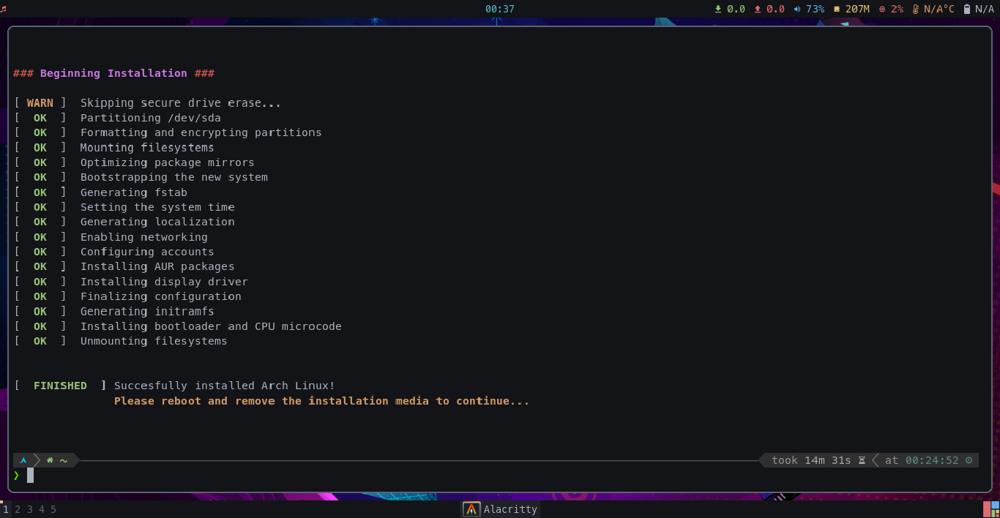

# Arch-GRIT

[](https://github.com/ralgar/arch-grit/tags)
[](https://github.com/ralgar/arch-grit/-/pipelines?page=1&scope=all&ref=master)
[](https://www.gnu.org/licenses/gpl-2.0.html)
[](https://github.com/ralgar/arch-grit)

Arch Graphical Recovery and Installation Tool.

A live, graphical Arch Linux ISO, with my personal installer written in Bash.

## About The Project



This is a project with only one goal - easy redeployment of my personal Arch installation.<br>

Some key points:
- **Sophisticated installer:** Able to take user input, handle a variety of hardware configurations, and deliver a fully functional system.
- **Security conscious:** Utilizes Full-Disk Encrytion, firewall, and good practices within the OS itself.
- **Data integrity:** The installed system uses BTRFS filesystem, with snapshots for easy system recovery. Comes with borg and borgmatic for easy, automatic, encrypted backups.
- **Graphical environment:** My custom AwesomeWM config, themed to match the terminal colorscheme. GTK and Qt toolkits are using a matching theme to give GUI applications a cohesive look. Heavily keyboard-driven interface.
- **Terminal environment:** Alacritty terminal for GPU acceleration, Zsh with completions and Powerlevel10k prompt, tmux for organizing workspaces, and a heavily customized instance of Vim. Cohesive colorscheme is applied everywhere.

The system is primarily designed for power users, such as sysadmins and developers.

### Built With

* [Arch Linux](https://archlinux.org)
* [Archiso](https://github.com/archlinux/archiso)

## Getting Started

There are two ways to use this project:
1. Build it from source with the [instructions below](#prerequisites), before
   continuing on to [Usage](#usage)
2. Download the [latest pre-built ISO](https://github.com/ralgar/arch-grit/releases)
   and write it to a USB drive, following the instructions in [Usage](#usage)

### Building

#### Prerequisites

To build the ISO, you will need an existing Arch Linux system with the
 `archiso` package installed. A containerized build system is also being
 developed for a future release.

1. Clone the repo:
   ```sh
   git clone https://github.com/ralgar/arch-grit.git
   ```
2. Navigate into the repo:
   ```sh
   cd arch-grit
   ```
3. Start the build using the included `Makefile`.
   ```sh
   sudo make
   ```

## Usage

To write the ISO to a USB drive, follow the instructions provided by the [Arch Linux Project](https://wiki.archlinux.org/title/USB_flash_installation_medium).

Boot from the live USB. The bootloader will present you with two options. If your system has sufficient RAM (at least 4GB), then I recommend choosing the `Copy to RAM` option for best performance. Otherwise, choose the default option.

When the live system has finished booting, it will automatically log in and launch a terminal window. The live environment is nearly identical to the final product, so this is a good opportunity to test it out before committing to a permanent installation.<br>

You can use the `arch-grit` command to accomplish several tasks, most notably installing a new system. It also provides some helper functions for system recovery purposes, such as decrypting and mounting an existing Arch-GRIT system.<br>
To learn more about the command run `arch-grit --help`.<br>
Note: Root privileges are required to run `arch-grit`, you can elevate the default user's privilege using `sudo` and the password `archlinux`

## License

Distributed under the GNU GPLv2 License. See `LICENSE` for more info.

## Acknowledgements

Some of the following software is showcased in this project:
* [AwesomeWM](https://github.com/awesomeWM/awesome)
* [Powerlevel10k](https://github.com/romkatv/powerlevel10k)
